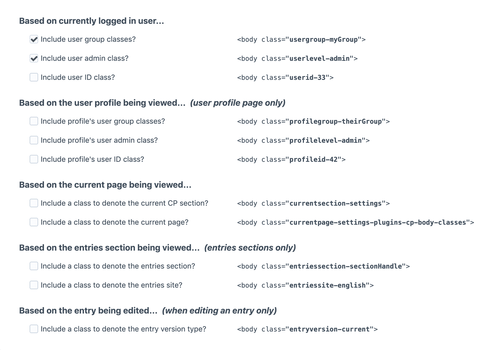

Control Panel Body Classes plugin for Craft CMS
===============================================

Add special classes to the Control Panel's `<body>` tag.

**Pairs perfectly with the [Control Panel CSS](https://github.com/doublesecretagency/craft-cpcss) and [Control Panel JS](https://github.com/doublesecretagency/craft-cpjs) plugins!**

After you've installed the plugin, go to:

- **Settings > Plugins > Control Panel Body Classes**

From the settings page, you can select which classes you want to use:

These special classes will now be included in the `<body>` tag of the CP. You can use these classes to manipulate the CSS & JavaScript of the Control Panel however you choose.

***

## But why?

Because there are a million things that you may want to do in your control panel, and many of them are conditional. Perhaps you want your CSS (or JS) to only take effect for a certain user group, or only on a specific page. Use these special classes to hone in on your targets with precision!

This plugin is designed to work in tandem with [Control Panel CSS](https://github.com/doublesecretagency/craft-cpcss) and/or [Control Panel JS](https://github.com/doublesecretagency/craft-cpjs).

***

## Disclaimer

>It's important to note that showing/hiding fields via CSS and JavaScript is **purely cosmetic**. Those fields may remain accessible to a savvy user, so don't rely on this plugin to guarantee access/denial of any DOM elements. **We accept no liability for any security issues arising from the use of this plugin.**

***

## Anything else?

We've got other plugins too!

Check out the full catalog at [doublesecretagency.com/plugins](https://www.doublesecretagency.com/plugins)
